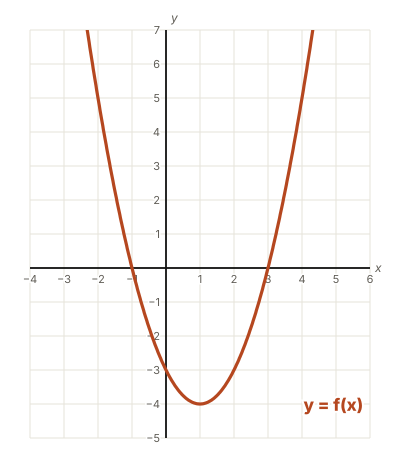
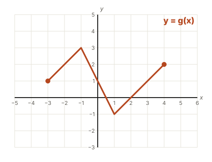

# What f(x) means

Algebra 2 is a tour of **function families**: lines, parabolas, absolute value, square roots, exponentials, logs. Each family has its own shape, but they all use one piece of notation, and it is the first thing that trips people up:

$$
f(x)
$$

It looks like "$f$ times $x$." **It is not.** By the end of this lesson you will read it without thinking, and you will be able to ask a function the two questions that every Algebra 2 unit keeps asking.

> [!KEY] The whole lesson in three lines
> - $f(x)$ is read "**f of x**." It means *the output of $f$ when the input is $x$*.
> - $f(3)$ asks you to **plug in**: put 3 in for $x$ and work it out.
> - $f(x) = 3$ asks you to **solve**: find every input that gives an output of 3.

## A function is a rule

A **function** is a rule that takes an **input** and gives back exactly **one output**. Think of it as a machine: a number goes in, the rule does something to it, and one number comes out.

$$
f(x) = 2x + 3
$$

This says: *the function is named $f$; call the input $x$; the output is $2x + 3$.* Put in 4, and $2(4) + 3 = 11$ comes out. We write that as

$$
f(4) = 11 \qquad \text{"f of 4 is 11"}
$$

| Input $x$ | Rule $2x + 3$ | Output $f(x)$ |
|---|---|---|
| $0$ | $2(0) + 3$ | $3$ |
| $4$ | $2(4) + 3$ | $11$ |
| $-1$ | $2(-1) + 3$ | $1$ |

> [!DEFINITION] Why "one output" matters
> A function never gives two different outputs for the same input. Different inputs *can* share an output. That is fine. But one input can never give two outputs.
>
> On a graph, this is the **vertical line test**: if any vertical line hits the graph more than once, it is not a function.

The name does not have to be $f$. You will see $g(x)$, $h(x)$, and even $p(t)$, where the input is called $t$ for time. The idea is always the same: **name(input) = output**.

## Plugging in

To find $f(\text{something})$, replace **every** $x$ in the rule with that something, **in parentheses**, and simplify.

> [!EXAMPLE] A quadratic
> $f(x) = x^2 - 3x$. Find $f(-2)$.
>
> $$
> f(-2) = (-2)^2 - 3(-2) = 4 + 6 = 10
> $$

> [!WARNING] Parentheses around negatives
> $(-2)^2 = 4$, but $-2^2 = -4$ because only the 2 gets squared. Put the input in parentheses every time you plug in, and this mistake goes away.

The output is the **y-coordinate**. So $f(-2) = 10$ also says the point $(-2, 10)$ is on the graph of $f$. Every "$f(a) = b$" is a point $(a, b)$.

```quiz
title: Checkpoint 1 — plug it in

1. $f(x) = 3x - 5$. What is $f(4)$?
   = 7
   > $3(4) - 5 = 12 - 5 = 7$.

2. $f(x) = 3x - 5$. What is $f(-2)$?
   = -11 | −11
   > $3(-2) - 5 = -6 - 5 = -11$.

3. $g(x) = x^2 + 1$. What is $g(-3)$?
   = 10
   > $(-3)^2 + 1 = 9 + 1 = 10$. If you got $-8$, you squared without the parentheses.

4. $h(x) = x^2 - 4x$. What is $h(-1)$?
   = 5
   > $(-1)^2 - 4(-1) = 1 + 4 = 5$.

5. $p(t) = 20 - 4t$ is the money left on a transit card after $t$ rides. What does $p(3) = 8$ mean?
   - [x] After 3 rides, there is \$8 left on the card.
   - [ ] After 8 rides, there is \$3 left on the card.
   - [ ] 3 rides cost \$8.
   > The input is $t = 3$ rides and the output is \$8 left.

6. $f(x) = 2x + 3$, so $f(1) = 5$. Which point is on the graph of $f$?
   - [ ] $(5, 1)$
   - [x] $(1, 5)$
   - [ ] $(2, 3)$
   > $f(a) = b$ is the point $(a, b)$: input first, output second.
```

## f(x) = 11 is a different question

This is the one that costs points on the Regents. Look at where the number sits:

| You see | The 11 is the… | So you… |
|---|---|---|
| $f(11)$ | **input** | plug in 11 for $x$ |
| $f(x) = 11$ | **output** | solve an equation to find $x$ |

> [!EXAMPLE] Same function, two questions
> $f(x) = 3x - 4$
>
> - $f(11) = 3(11) - 4 = 29$. You plugged 11 in.
> - $f(x) = 11$ means $3x - 4 = 11$, so $3x = 15$ and $x = 5$. You solved for the input.

Solving $f(x) = 11$ is just the equation solving from Algebra 1: move the terms, then detach the coefficient. So the step calculator is back. Each problem below tells you the function and the output, and you solve for the input. Your moves go on your tape.

```calc
title: Assigned work — find the input
points: 2

1. 3x - 4 = 11
   ? f(x) = 3x - 4. Find x when f(x) = 11.
   > 3x = 15, so x = 5. Check: f(5) = 3(5) - 4 = 11.
2. 5 - 2x = -9
   ? g(x) = 5 - 2x. Find x when g(x) = -9.
   > −2x = −14, so x = 7.
3. x/2 + 6 = 10
   ? h(x) = x/2 + 6. Find x when h(x) = 10.
   > x/2 = 4, so x = 8.
4. 20 - 4t = 0
   ? p(t) = 20 - 4t is the money left on a transit card after t rides. After how many rides is it empty? (Solve p(t) = 0.)
   > 4t = 20, so t = 5 rides.
5. 3(x - 2) = 12
   ? k(x) = 3(x - 2). Find x when k(x) = 12.
   > Detach the 3 first: x − 2 = 4, so x = 6.
6. 4x + 1 = 2x + 9
   ? f(x) = 4x + 1 and g(x) = 2x + 9. Find the x where f(x) = g(x).
   > 2x = 8, so x = 4. Both functions give 17 there: that is where their graphs cross.
```

## Reading a function off its graph

A graph **is** a function, drawn. Every point on it is $(x, f(x))$, an input and its output. You can ask the graph both questions, with no formula at all:

> [!STEPS] Two questions, two directions
> 1. **Plug in, $f(a)$.** Start at $x = a$ on the x-axis. Go straight up or down to the graph. Read the height: that height is $f(a)$.
> 2. **Solve, $f(x) = b$.** Start at height $b$ on the y-axis. Go straight across and mark **every** place you hit the graph. Read the x-value of each one. There can be one answer, several, or none.

Try both directions in the function reader. The "g: a path" graph has no formula at all.

```embed
function-reader.html
height: 820
```

## Domain and range

- The **domain** is every input the function accepts, the $x$'s it uses.
- The **range** is every output it actually gives back, the $y$'s it reaches.

On a graph: squash the graph straight down onto the x-axis, and the shadow is the **domain**. Squash it sideways onto the y-axis, and the shadow is the **range**. Turn on "Show domain and range" in the reader to see the shadows.

> [!EXAMPLE] Three quick ones
> - $f(x) = 2x - 1$, a line: domain **all real numbers**, range **all real numbers**.
> - $f(x) = x^2 - 2x - 3$, a parabola with its lowest point at $(1, -4)$: domain **all real numbers**, range $y \ge -4$.
> - $f(x) = \sqrt{x + 3}$: you can't take the square root of a negative, so the domain is $x \ge -3$, and the range is $y \ge 0$.

## Checkpoint 2 — read the graphs

Use these two graphs for the checkpoint.





```quiz
title: Checkpoint 2 — read the graphs

1. Figure A: what is $f(0)$?
   = -3 | −3
   > Start at $x = 0$, go down to the graph: height $-3$.

2. Figure A: what is $f(4)$?
   = 5
   > At $x = 4$ the graph is at height 5.

3. Figure A: which inputs make $f(x) = 0$? (pick every one)
   - [x] $x = -1$
   - [x] $x = 3$
   - [ ] $x = 0$
   - [ ] $x = -3$
   > Height 0 is the x-axis. The graph crosses it at $-1$ and at $3$. Two inputs, one output: that is allowed.

4. Figure B: what is $g(-1)$?
   = 3
   > At $x = -1$ the path is at its highest point, height 3.

5. Figure B: how many different inputs make $g(x) = 1$?
   = 3
   > Go across at height 1: you hit the path at $x = -3$, $x = 0$, and $x = 3$.

6. Figure B: what is the domain of $g$?
   - [x] $-3 \le x \le 4$
   - [ ] $-1 \le x \le 3$
   - [ ] all real numbers
   > The path starts at $x = -3$ and stops at $x = 4$.

7. Figure A: what is the range of $f$?
   - [ ] all real numbers
   - [x] $y \ge -4$
   - [ ] $y \ge -3$
   > The lowest point is at height $-4$, and the graph goes up forever from there.

8. Which of these is **not** a function?
   - [x] $\{(1, 2),\ (2, 3),\ (1, 5)\}$
   - [ ] $\{(1, 2),\ (2, 2),\ (3, 2)\}$
   - [ ] $\{(0, 0),\ (1, 1),\ (2, 4)\}$
   > In the first set, the input 1 gives two different outputs, 2 and 5. The second set is fine: different inputs are allowed to share an output.
```

## Wrap up

- $f(x)$ is "f of x": the **output** when the **input** is $x$. It is not multiplication.
- $f(a)$ means **plug in** $a$, in parentheses. $f(a) = b$ is the point $(a, b)$.
- $f(x) = b$ means **solve**: find every input with output $b$. That can be one answer, several, or none.
- **Domain** is the inputs, the shadow on the x-axis. **Range** is the outputs, the shadow on the y-axis.
- One input never gives two outputs. That is what makes it a function.

More reps are in the [extra practice](practice.md). **Next up:** moving graphs around. $f(x) + 2$ moves a graph up 2, but $f(x - 3)$ moves it **right** 3, and you will find out why.
